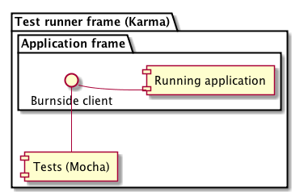

## Burnside

> Test your entire app, end to end, in pure Javascript

Burnside is an easy to use, modular, and extendable End to End (E2E) testing tool. Burnside leverages the flexibility of Javascript and the power of modern Browser APIs to inject logic and scripting into your website, without the slowdown of networking for every individual command.

### Check out Burnside's interactive, Test-Driven Tutorial workshop!
> System requirements: Node v6
```
npm install && npm run custom-install
npm run tutorial
```

<a name="installation"></a>
### Installation

```
$ npm install --save-dev burnside-cli
```

<a name="usage"></a>
### Usage
```JSON
{
  "scripts": {
    "burnside": "burnside ./path/to/tests.js --startup='./exampleServer.sh' --condition='start' --wait=5000 --browsers=chrome,firefox"
  }
}  
```

| Option | Example | Purpose |
| ------ | ------- | ------- |
| `<default>` | `./path/to/tests.js` | Your Test File |
| `startup` | `--startup='./exampleServer.sh'` | A BASH Command representing your application's startup command |
| `condition` | `--condition='startup'` | An _optional_ startup message for Burnside to wait on |
| `wait` | `--wait=500` | The amount of time Burnside will wait for the `startup` `condition` to be reached, if specified. Defaults to 5000 |
| `browsers` | `--browsers=chrome,firefox` | The browsers Burnside should attempt to use when testing. Available: `chrome` and `firefox` |

Burnside is a modular ecosystem based on a core that runs inside of a Browser. The CLI bundles Karma and Webpack to load your tests within Chrome, but you can use Burnside's core with any Test Runner you'd like to set up.
> If you'd like to configure your own test runner, we've included the `packages/burnside-sample` project configured to use Karma and Webpack directly.

<a name="basic-usage"></a>
### Test usage
```js
const Burnside = window.Burnside; // or `import Burnside` if you're not using the CLI

const burnside = new Burnside({
  host: 'http://localhost:3000',
  path: '/index.html'
});

// now you can execute any function and capture the result!
burnside
  .exec(['.header'], selector => {
    return document.querySelector(selector);
  })
  .then(value => {
    // assert on value here
  })
```

<a name="cli-usage"></a>
### Command Line Options
Burnside's CLI supports the following flags:

- `-w` or `--watchmode` Keeps the browser running and watches your test files for changes.
- `-b chrome,firefox` or `--browsers chrome,firefox` Specifies the browsers to test with.

> Currently only `chrome` and `firefox` are available and must installed on the machine in order to operate properly.

<a name="how"></a>
### How It Works

Burnside runs your application inside an iframe and uses iframe messaging to communicate between test code and the application. This is in contrast to the approach taken by the Selenium webdriver, which instead uses HTTP to communicate interactions between tests and the application, introducing more network latency and inconsistency to your test suite.



## License

[Apache 2.0](LICENSE.txt)
